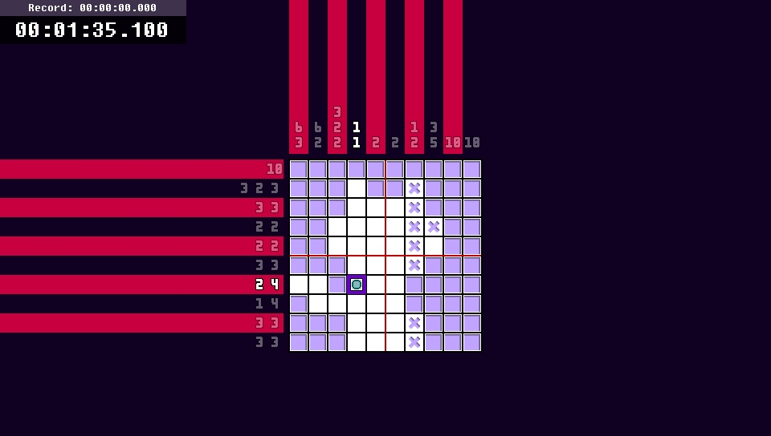

# PiCrest
Nonogram game for PSVita 

## Features:
* Level Editor with palette (R,G,B,H,S,V,A(alpha))
* Themes Editor
* Level Generator
* 75 Levels
* Multilanguage support (English, Russian, Latina(thanks to overmind98))
## How to play:
* <kbd>DPAD</kbd> - Move
* <kbd>Cross</kbd> - place field
* <kbd>Circle</kbd> - place cross
* <kbd>Square</kbd> - pencil
## Building:
To build the game open `build.bat`, it will create PiCrest.vpk file, that can be installed on your PSVita
## Download
You can [download](https://github.com/Creckeryop/PiCrest/releases/latest) latest .vpk of PiCrest

## Screenshots:

 
 

## Links
* [Lua Player Plus for Vita](https://github.com/Rinnegatamante/lpp-vita) (by [Rinnegatamante](https://github.com/Rinnegatamante/))
